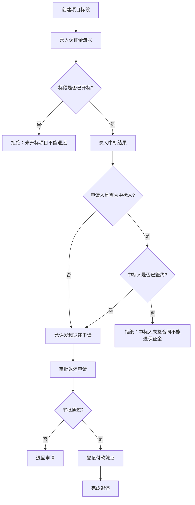

## 1. 产品概述

招投标保证金退还管理系统，用于管理招投标全流程中的保证金缴纳、中标结果确认、退还申请审批及付款凭证归档。解决保证金退还流程不透明、人工审批效率低、违规退还风险等问题，面向招标代理机构和采购中心的业务人员。

## 2. 核心功能

### 2.1 用户角色

| 角色 | 注册方式 | 核心权限 |
|------|----------|----------|
| 业务操作员 | 管理员分配账号 | 创建项目标段、录入保证金流水、提交退还申请 |
| 审批管理员 | 管理员分配账号 | 审批退还申请、确认付款凭证、查看统计报表 |

### 2.2 功能模块

1. **项目标段管理页**：项目标段列表、新增标段、编辑标段状态（未开标/已开标/已定标/已签约）
2. **保证金流水页**：保证金缴纳记录列表、新增缴纳记录、关联项目标段
3. **中标结果页**：中标结果列表、录入中标人信息、标记合同签约状态
4. **退还申请页**：发起退还申请、审批流转、业务规则校验拦截
5. **付款凭证页**：凭证登记、关联退还申请、凭证状态跟踪

### 2.3 页面详情

| 页面名称 | 模块名称 | 功能描述 |
|----------|----------|----------|
| 项目标段管理 | 标段列表 | 表格展示所有标段，含项目名称、标段编号、开标状态、定标状态、签约状态，支持筛选和新增 |
| 项目标段管理 | 标段表单 | 新增/编辑标段：项目名称、标段编号、标段名称、开标日期、状态切换 |
| 保证金流水 | 流水列表 | 展示所有保证金缴纳记录，含缴纳方、金额、币种、关联标段、缴纳日期 |
| 保证金流水 | 流水表单 | 新增缴纳记录：选择标段、缴纳方名称、金额、缴纳日期 |
| 中标结果 | 结果列表 | 展示所有中标结果，含标段、中标人、中标日期、是否签约 |
| 中标结果 | 结果表单 | 录入中标结果：选择已开标标段、中标人名称、中标日期、签约状态 |
| 退还申请 | 申请列表 | 展示所有退还申请及审批状态，含申请编号、申请标段、申请人、金额、状态标签 |
| 退还申请 | 发起申请 | 选择保证金流水、填写退还原因，系统自动校验：未开标标段拒绝、中标人未签约拒绝 |
| 付款凭证 | 凭证列表 | 展示所有付款凭证，含凭证号、关联退还申请、付款金额、付款日期、状态 |
| 付款凭证 | 凭证登记 | 对已审批通过的退还申请登记付款凭证 |

## 3. 核心流程

用户创建项目标段 → 投标方缴纳保证金（录入流水） → 开标并确定中标人 → 中标人签约合同 → 非中标人发起保证金退还申请 → 系统校验业务规则 → 审批通过 → 登记付款凭证 → 完成退还。

关键校验规则：
- 未开标的项目标段，任何保证金均不可发起退还
- 中标人未签合同的标段，中标人的保证金不可退还（非中标人可退）

## 4. 用户界面设计

### 4.1 设计风格

- 主色调：深靛蓝 (#1e3a5f) 搭配琥珀金 (#d4a843) 强调色，体现招投标场景的正式与严谨
- 辅助色：石板灰 (#64748b) 用于次要信息，翡翠绿 (#10b981) 用于成功状态，珊瑚红 (#ef4444) 用于拒绝/错误状态
- 按钮风格：圆角 6px，主操作按钮使用靛蓝底色白字，危险操作使用红色底色
- 字体：思源黑体 / Noto Sans SC，正文 14px，标题 20px，大标题 28px
- 布局：左侧导航栏 + 右侧内容区，卡片式内容模块
- 图标：使用 lucide-react 图标库

### 4.2 页面设计概览

| 页面名称 | 模块名称 | UI 元素 |
|----------|----------|----------|
| 项目标段管理 | 标段列表 | 表格+筛选区，状态标签使用彩色徽章，操作列含编辑/查看按钮 |
| 项目标段管理 | 标段表单 | 右侧抽屉式表单，含日期选择器和下拉框 |
| 保证金流水 | 流水列表 | 表格+筛选区，金额列右对齐，标段名称可点击跳转 |
| 保证金流水 | 流水表单 | 模态框表单，标段选择使用搜索下拉 |
| 中标结果 | 结果列表 | 表格+筛选区，签约状态使用开关图标 |
| 中标结果 | 结果表单 | 模态框表单，标段下拉仅显示已开标标段 |
| 退还申请 | 申请列表 | 表格+筛选区，状态列使用步骤标签（待审批/已通过/已拒绝/已退回） |
| 退还申请 | 发起申请 | 模态框表单，提交时弹出校验结果，拒绝时显示红色错误提示 |
| 付款凭证 | 凭证列表 | 表格+筛选区，关联申请号可点击跳转 |
| 付款凭证 | 凭证登记 | 模态框表单，仅对已审批通过的申请开放 |

### 4.3 响应式设计

桌面优先设计，最小宽度 1024px，内容区自适应，表格支持横向滚动。

### 4.4 3D 场景

不适用
