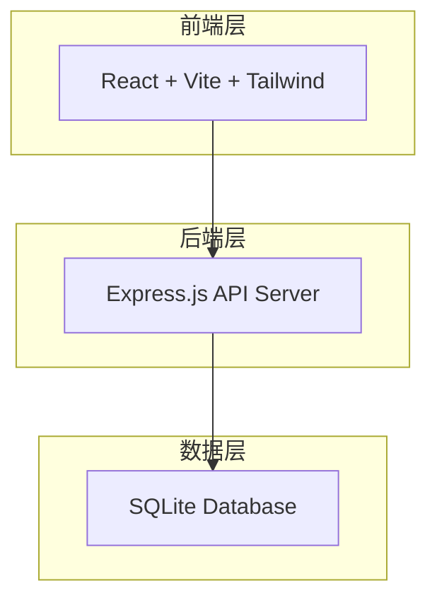
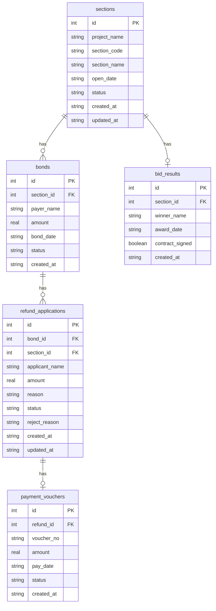

## 1. 架构设计



## 2. 技术说明

- 前端：React@18 + Tailwind CSS@3 + Vite + Zustand
- 初始化工具：vite-init (react-express-ts 模板)
- 后端：Express@4 + TypeScript (ESM)
- 数据库：SQLite (better-sqlite3)
- 包管理器：npm

## 3. 路由定义

| 路由 | 用途 |
|------|------|
| / | 首页仪表盘，展示统计数据 |
| /sections | 项目标段管理 |
| /bonds | 保证金流水管理 |
| /results | 中标结果管理 |
| /refunds | 退还申请管理 |
| /vouchers | 付款凭证管理 |

## 4. API 定义

### 项目标段 API

| 方法 | 路径 | 说明 |
|------|------|------|
| GET | /api/sections | 获取标段列表 |
| POST | /api/sections | 新增标段 |
| PUT | /api/sections/:id | 更新标段 |
| GET | /api/sections/:id | 获取标段详情 |

### 保证金流水 API

| 方法 | 路径 | 说明 |
|------|------|------|
| GET | /api/bonds | 获取保证金流水列表 |
| POST | /api/bonds | 新增保证金流水 |
| GET | /api/bonds/:id | 获取流水详情 |

### 中标结果 API

| 方法 | 路径 | 说明 |
|------|------|------|
| GET | /api/results | 获取中标结果列表 |
| POST | /api/results | 新增中标结果 |
| PUT | /api/results/:id | 更新中标结果（如签约状态） |

### 退还申请 API

| 方法 | 路径 | 说明 |
|------|------|------|
| GET | /api/refunds | 获取退还申请列表 |
| POST | /api/refunds | 发起退还申请（含业务规则校验） |
| PUT | /api/refunds/:id/approve | 审批通过 |
| PUT | /api/refunds/:id/reject | 审批拒绝 |

### 付款凭证 API

| 方法 | 路径 | 说明 |
|------|------|------|
| GET | /api/vouchers | 获取付款凭证列表 |
| POST | /api/vouchers | 登记付款凭证 |

### TypeScript 类型定义

```typescript
interface Section {
  id: number;
  project_name: string;
  section_code: string;
  section_name: string;
  open_date: string | null;
  status: 'unopened' | 'opened' | 'awarded' | 'contracted';
  created_at: string;
  updated_at: string;
}

interface Bond {
  id: number;
  section_id: number;
  payer_name: string;
  amount: number;
  bond_date: string;
  status: 'paid' | 'refunded' | 'partial_refunded';
  created_at: string;
}

interface BidResult {
  id: number;
  section_id: number;
  winner_name: string;
  award_date: string;
  contract_signed: boolean;
  created_at: string;
}

interface RefundApplication {
  id: number;
  bond_id: number;
  section_id: number;
  applicant_name: string;
  amount: number;
  reason: string;
  status: 'pending' | 'approved' | 'rejected' | 'paid';
  reject_reason: string | null;
  created_at: string;
  updated_at: string;
}

interface PaymentVoucher {
  id: number;
  refund_id: number;
  voucher_no: string;
  amount: number;
  pay_date: string;
  status: 'issued' | 'confirmed';
  created_at: string;
}
```

## 5. 服务端架构


## 6. 数据模型

### 6.1 数据模型定义



### 6.2 数据定义语言

```sql
CREATE TABLE IF NOT EXISTS sections (
  id INTEGER PRIMARY KEY AUTOINCREMENT,
  project_name TEXT NOT NULL,
  section_code TEXT NOT NULL UNIQUE,
  section_name TEXT NOT NULL,
  open_date TEXT,
  status TEXT NOT NULL DEFAULT 'unopened'
    CHECK(status IN ('unopened','opened','awarded','contracted')),
  created_at TEXT NOT NULL DEFAULT (datetime('now')),
  updated_at TEXT NOT NULL DEFAULT (datetime('now'))
);

CREATE TABLE IF NOT EXISTS bonds (
  id INTEGER PRIMARY KEY AUTOINCREMENT,
  section_id INTEGER NOT NULL REFERENCES sections(id),
  payer_name TEXT NOT NULL,
  amount REAL NOT NULL CHECK(amount > 0),
  bond_date TEXT NOT NULL,
  status TEXT NOT NULL DEFAULT 'paid'
    CHECK(status IN ('paid','refunded','partial_refunded')),
  created_at TEXT NOT NULL DEFAULT (datetime('now'))
);

CREATE TABLE IF NOT EXISTS bid_results (
  id INTEGER PRIMARY KEY AUTOINCREMENT,
  section_id INTEGER NOT NULL UNIQUE REFERENCES sections(id),
  winner_name TEXT NOT NULL,
  award_date TEXT NOT NULL,
  contract_signed INTEGER NOT NULL DEFAULT 0,
  created_at TEXT NOT NULL DEFAULT (datetime('now'))
);

CREATE TABLE IF NOT EXISTS refund_applications (
  id INTEGER PRIMARY KEY AUTOINCREMENT,
  bond_id INTEGER NOT NULL REFERENCES bonds(id),
  section_id INTEGER NOT NULL REFERENCES sections(id),
  applicant_name TEXT NOT NULL,
  amount REAL NOT NULL CHECK(amount > 0),
  reason TEXT NOT NULL,
  status TEXT NOT NULL DEFAULT 'pending'
    CHECK(status IN ('pending','approved','rejected','paid')),
  reject_reason TEXT,
  created_at TEXT NOT NULL DEFAULT (datetime('now')),
  updated_at TEXT NOT NULL DEFAULT (datetime('now'))
);

CREATE TABLE IF NOT EXISTS payment_vouchers (
  id INTEGER PRIMARY KEY AUTOINCREMENT,
  refund_id INTEGER NOT NULL REFERENCES refund_applications(id),
  voucher_no TEXT NOT NULL UNIQUE,
  amount REAL NOT NULL CHECK(amount > 0),
  pay_date TEXT NOT NULL,
  status TEXT NOT NULL DEFAULT 'issued'
    CHECK(status IN ('issued','confirmed')),
  created_at TEXT NOT NULL DEFAULT (datetime('now'))
);

-- 初始演示数据
INSERT INTO sections (project_name, section_code, section_name, open_date, status) VALUES
  ('城市道路改造工程', 'SEC-2024-001', '一标段', '2024-03-15', 'contracted'),
  ('城市道路改造工程', 'SEC-2024-002', '二标段', '2024-03-15', 'awarded'),
  ('智慧园区建设项目', 'SEC-2024-003', '施工标段', NULL, 'unopened'),
  ('污水处理厂扩建', 'SEC-2024-004', '设备采购标段', '2024-04-01', 'opened');

INSERT INTO bonds (section_id, payer_name, amount, bond_date) VALUES
  (1, '华建集团有限公司', 500000, '2024-02-20'),
  (1, '中天建设集团', 500000, '2024-02-21'),
  (2, '大华工程有限公司', 300000, '2024-02-22'),
  (3, '远东建设有限公司', 200000, '2024-03-01'),
  (4, '绿城建设集团', 400000, '2024-03-15');

INSERT INTO bid_results (section_id, winner_name, award_date, contract_signed) VALUES
  (1, '华建集团有限公司', '2024-03-20', 1),
  (2, '大华工程有限公司', '2024-03-25', 0);

INSERT INTO refund_applications (bond_id, section_id, applicant_name, amount, reason, status) VALUES
  (2, 1, '中天建设集团', 500000, '未中标，申请退还保证金', 'approved');
```
